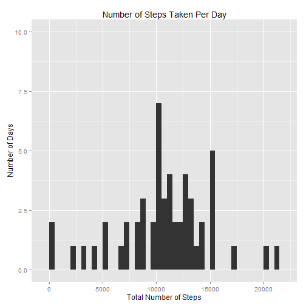
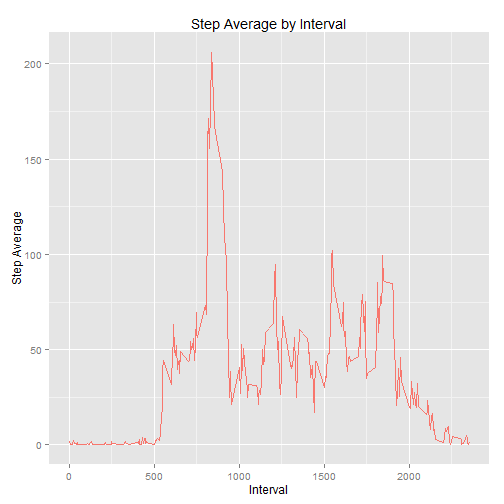
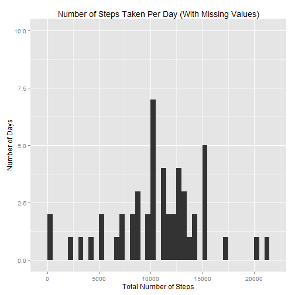
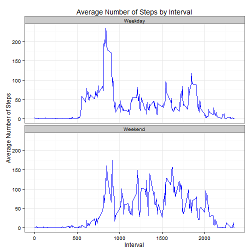

## Required R libraries

The following R libraries were used to produce this document.

* knitr
* ggplot2
* dplyr


```r
options(warn=-1)
library(knitr)
library(ggplot2)
library(dplyr)
options(warn=0)
```


## Loading and preprocessing the data

1) We load our data set.  This data is assumed to be in data subdirectory.


```r
df_act <- read.csv('data/activity.csv', header = TRUE, sep = ",", 
                   colClasses=c("numeric", "character", "numeric"))
```

2) We coerce our data into data types that we can use for analysis.

```r
df_act$date <- as.Date(df_act$date)
```

## What is mean total number of steps taken per day?

1) We will sum all our steps by day.  **NA values are excluded** from the analysis but **zero values are included.**

```r
by_date <- df_act[!is.na(df_act$steps), ] %>% group_by(date) %>% summarise(step_sum = sum(steps, na.rm = TRUE))
```

2) We create a histogram to show a graphical view of date to step sums.

```r
qplot(x = step_sum, data = by_date, geom="histogram", xlab = "Total Number of Steps", ylab = "Number of Days", binwidth = 500,
        main = "Number of Steps Taken Per Day", ylim = c(0, 10))
```

 

3) We calculate the mean and median for the total number of steps taken per day.

```r
step_mean <- mean(by_date$step_sum, na.rm = TRUE)
step_median <- median(by_date$step_sum, na.rm = TRUE)
```

Mean: **10766.2**

Median: **10765**


## What is the average daily activity pattern?

1) We summarize the average number of steps by 5-minute intervals.


```r
by_interval <- df_act %>% group_by(interval) %>% summarise(step_avg = mean(steps, na.rm = TRUE))
```

2) We create a time series of interval vs. step average.


```r
ggplot() + 
  geom_line(data = by_interval, aes(x = interval, y = step_avg, color = "red")) +
  labs(title = 'Step Average by Interval', x = 'Interval', y = 'Step Average') +
  guides(color = 'none')
```

 

3) We find the 5-minute interval that contains the maximum number of steps.


```r
by_interval[by_interval$step_avg == max(by_interval$step_avg),]
```

```
## Source: local data frame [1 x 2]
## 
##   interval step_avg
## 1      835 206.1698
```

## Imputing missing values

1) We report the number of records which have missing values, or NA.


```r
sum(is.na(df_act$steps))
```

```
## [1] 2304
```

2) To fill in the NA values, we will multiply the mean total number of steps to the weighted step average by interval.


```r
step_byintervalvector <- mutate(by_interval, stepbyinterval = step_mean * by_interval$step_avg / sum(by_interval$step_avg))
```

3) Using the Step Total by Interval vector we just created, we fill in the NA values of the original data set to create a new data set.


```r
df_act <- inner_join(df_act, step_byintervalvector)
```

```
## Joining by: "interval"
```

```r
df_act <- mutate(df_act, step_NAfill = ifelse(is.na(steps), stepbyinterval, steps))
df_act <- subset(df_act, select = -c(step_avg, stepbyinterval))
```

4) Now we make a histogram of this new data set and find its mean and median.


```r
by_date.NAfill <- df_act %>% group_by(date) %>% summarise(step_sum = sum(step_NAfill, na.rm = TRUE))

qplot(x = step_sum, data = by_date.NAfill, geom="histogram", xlab = "Total Number of Steps", ylab = "Number of Days", binwidth = 500,
        main = "Number of Steps Taken Per Day (WIth Missing Values)", ylim = c(0, 10))
```

 


```r
step_mean.NAfill <- mean(by_date.NAfill$step_sum, na.rm = TRUE)
step_median.NAfill <- median(by_date.NAfill$step_sum, na.rm = TRUE)
```

Mean (with Missing Values): **10766.2**

Median (with Missing Values): **10766.2**

As can be seen in the histograph, addition of the missing values has made a more normal distribution of observations (ie, more observations of days can be seen at the mean step value).  Median remains unchanged.

## Are there differences in activity patterns between weekdays and weekends?

1) We add another column to the data set to indicate a weekend or weekday.  We also add average number of steps.


```r
char_weekdays = c('Monday', 'Tuesday', 'Wednesday', 'Thursday', 'Friday')
df_act <- mutate(df_act, weekday = ifelse(weekdays(df_act$date) %in% char_weekdays, 'Weekday', 'Weekend'))

by_weekday <- df_act %>% group_by(weekday, interval) %>% summarise(step_avg = mean(steps, na.rm = TRUE))
```

2) We include a histogram to compare the dataset with weekends to weekdays.


```r
ggplot(by_weekday, aes(x=interval, y=step_avg)) + 
        geom_line(color="blue") + 
        facet_wrap(~ weekday, nrow=2, ncol=1) +
        labs(x="Interval", y="Average Number of Steps", title="Average Number of Steps by Interval") +
        theme_bw()
```

 

Based on the histogram, it would seem that walking on weekdays spike to an average of 200 steps per day in the interval from 750 to 1000 minutes, and goes no higher than 100 steps per day afterwards.  In contrast, during the weekends and after the 750 interval, there is an average of 75-100 step taken per day.  This can perhaps be explained from a typical workweek schedule (walking only to commute and remaining stationary for most of the day vs. having more time for leisure during the weekend).


